## PURPOSE
Presentation of the domain concerns and logical components supporting the Risk Management bounded context at the model layer.

# FUNCTIONAL VIEW

```mermaid
%%{
  init: {
    'theme': 'base',
    'themeVariables': {
        'background': '#ffffff',
        'fontFamily': 'arial',
        'fontSize': '10px',
        'primaryColor': '#fff',
        'primaryTextColor': '#0e2a43',
        'primaryBorderColor': '#0e2a43',
        'secondaryColor': '#fff',
        'secondaryTextColor': '#fff',
        'secondaryBorderColor': '#fff',
        'tertiaryColor': '#fff',
        'tertiaryTextColor': '#fff',
        'tertiaryBorderColor': '#fff',
        'edgeLabelBackground':'#fff',
        'lineColor': '#0e2a43',
        'titleColor': '#fff',
        'textColor': '#fff',
        'lineColor': '#0e2a43',
        'nodeTextColor': '#fff',
        'nodeBorder': '#0e2a43',
        'noteTextColor': '#fff',
        'noteBorderColor': '#fff'
    },
    'flowchart': { 'curve': 'monotoneX' }
  }
}%%
flowchart TB

  classDef concern fill:#0e2a43, color:#fff
  classDef example fill:#e5302a, stroke:#e5302a, color:#fff

```

# DESIGN VIEW
Several components of specification or implementation are supporting the domain provided over the `org.cybnity.application.risk-management.domain` project's deliverable.

## STRUCTURE MODELS
Several sub-packages are implemented according to the specialization of sub-domains.

### DOMAIN SUB-PACKAGE
The package `org.cybnity.riskmanagement.domain.model` provide standard components regarding the risk management of any type, as features and domain objects.

|Class Type|Motivation|
| :-- | :-- |
|...|...|

```mermaid
%%{
  init: {
    'theme': 'base',
    'themeVariables': {
        'background': '#ffffff',
        'fontFamily': 'arial',
        'fontSize': '18px',
        'primaryColor': '#fff',
        'primaryBorderColor': '#0e2a43',
        'secondaryBorderColor': '#0e2a43',
        'tertiaryBorderColor': '#0e2a43',
        'edgeLabelBackground':'#0e2a43',
        'lineColor': '#0e2a43',
        'tertiaryColor': '#fff'
    }
  }

}%%
classDiagram
    class X {
    }

```


### YYY SUB-PACKAGE
The package `org.cybnity.riskmanagement.yyy.domain.model` provide components required to ....

# IMPLEMENTATION VIEW
Presentation of the core components and files organization, packaging models and dependencies, and addressed configuration management of systems released. Globally this section give overview of technical components and structures implemented as domain layer.

- Structural diagrams regarding the domain model components
- Behavioral diagrams regarding the interactions, states machins and activities provided by the model
- System assembly is mainly managed by Maven as a Java library artifact reused by the application service layer

# RELEASES HISTORY
- [V0 - FRAMEWORK changes list](v0-changes.md)

#
[Back To Home](/README.md)
